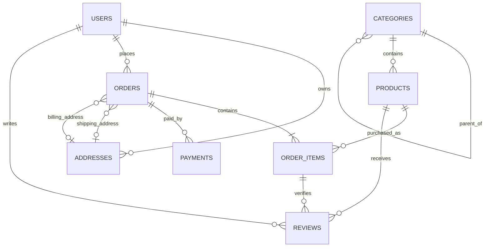

# E-Commerce Database Design & Modeling

This document explains the complete database model implemented in `sql/ecommerce_complete_schema_mysql.sql`.

## Design Goals

- Keep transactional data normalized and easy to maintain.
- Preserve order history even when products, prices, or addresses change later.
- Use clear primary keys, foreign keys, unique constraints, and indexes.
- Support common e-commerce workflows: browsing products, placing orders, paying, shipping, and reviewing products.

## Core Entities

- `users` - customer and admin accounts.
- `addresses` - reusable shipping and billing addresses for users.
- `categories` - product categories with optional parent categories.
- `products` - sellable catalog items.
- `orders` - order headers with totals, status, shipping snapshot, and timestamps.
- `order_items` - products purchased inside an order.
- `payments` - payment attempts and captured payments for orders.
- `reviews` - product ratings and comments from users.

## Normalization

### 1NF

Each table uses atomic values. For example, an order does not store a comma-separated list of products. Products in an order are stored in `order_items`, one row per purchased product.

### 2NF

Every non-key column depends on the whole primary key. For example, `order_items.quantity`, `unit_price`, and `line_total` describe one specific order item row, not just the order or just the product.

### 3NF

Non-key columns do not depend on other non-key columns. For example, product category information is stored in `categories`, not repeated inside `products` beyond the `category_id` foreign key.

### BCNF

Business identifiers with independent uniqueness are constrained separately. For example:

- `users.email` is unique.
- `products.sku` is unique.
- `products.slug` is unique.
- `orders.order_number` is unique.
- `payments.payment_reference` is unique.

These are candidate keys, while the schema still uses surrogate primary keys for stable relationships.

## Intentional Denormalization

The schema denormalizes checkout-time data where history matters:

- `orders` stores shipping recipient and address snapshot fields.
- `order_items` stores `sku_snapshot`, `product_name_snapshot`, and `unit_price`.

This is intentional. If a customer changes their address or an admin edits a product name later, old invoices and order history must still show what was true at purchase time.

## Primary Key vs Surrogate Key

The schema uses surrogate keys like `user_id`, `product_id`, and `order_id` as primary keys.

Natural keys still exist as unique constraints:

- `email`
- `sku`
- `slug`
- `order_number`
- `payment_reference`

This gives clean joins and avoids changing foreign keys if a business value changes.

## Foreign Keys & Cascading

- Deleting a user cascades to addresses and reviews, but not orders. Orders use `ON DELETE RESTRICT` so purchase history is protected.
- Deleting an order cascades to `order_items` and `payments`.
- Deleting a product is restricted if order items exist, because order history must remain valid.
- Deleting a category is restricted if products still belong to it.
- Deleting an address sets related order address references to `NULL`, while the order keeps its shipping snapshot fields.
- Deleting a review owner or reviewed product cascades reviews, because reviews are dependent content.

## ER Diagram

## Scalable Schema Practices Used

- Use `BIGINT UNSIGNED` for primary keys to allow growth.
- Add indexes on common filters and join paths.
- Keep money values as `DECIMAL`, not floating-point types.
- Track creation and update timestamps.
- Use status columns for lifecycle management instead of deleting important business records.
- Use product/order snapshots for historical accuracy.
- Use views for repeated read models such as product catalog and order summary.
- Keep one-to-many relationships in separate tables instead of repeating columns.

## Suggested Next Improvements

- Add carts and cart items.
- Add product images.
- Add shipment tracking.
- Add coupons and promotions.
- Replace `ENUM` values with lookup tables if statuses need to be user-configurable.
- Add audit tables for admin changes.
